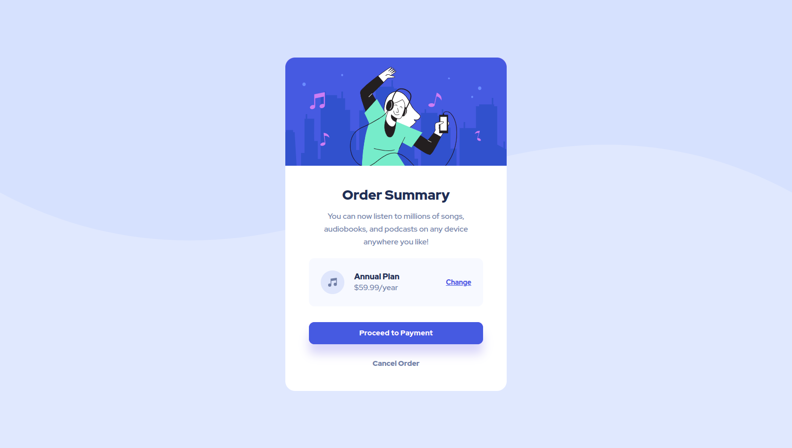

# Frontend Mentor - Order summary card solution

This is a solution to the [Order summary card challenge on Frontend Mentor](https://www.frontendmentor.io/challenges/order-summary-component-QlPmajDUj). 

## Table of contents

- [Overview](#overview)
  - [The challenge](#the-challenge)
  - [Screenshot](#screenshot)
  - [Links](#links)

## Overview

### The challenge

Users should be able to:

- See hover states for interactive elements

### Screenshot

### Links

- Solution URL: [Here](https://github.com/kxrn0/Front-End-Challenges/tree/main/order-summary-component-main)
- Live Site URL: [There](https://kxrn0.github.io/Front-End-Challenges/order-summary-component-main.index.html)